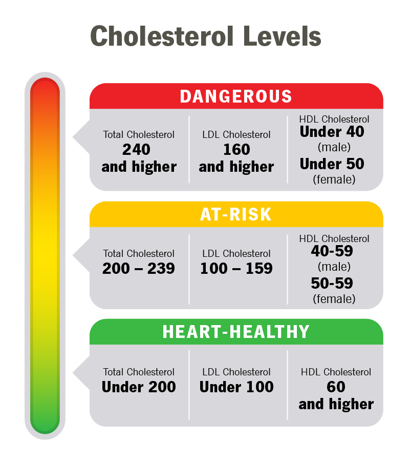

# Lab Rules

## Classifications
Normal:
LDL <= 100
HDL >= 60

Abnormal:
LDL > 100
HDL < 60

## Source
Cleveland Clinic:
https://my.clevelandclinic.org/health/articles/11920-cholesterol-numbers-what-do-they-mean

## Video
https://youtu.be/ER32jV0I-no

## GCP
URL: https://cholesterol-level-570119871231.europe-west1.run.app

## GCP vs Azure
The creation of both a GCP cloud run app and Azure function app were straightforward to begin and used similar steps. However, I do believe the GCP function creation was slightly more steamlined, but had less options. However, for our purposes being so simple it did feel easier. When it came to the code, the fact that I was able to get the GCP function working and was not with Azure explains my situation. The passkey for Azure would likely be helpful for security in real-world applications, but for our purposes it did just make it more complicated. I did like the ability to test the Azure function while in the website was helpful. With GCP, the template that was catered to it definitely helped to seamlessly create an app. I will be looking further into what went wrong with the Azure app, but with the amount of errors I had with it I will say that I prefer GCP.
